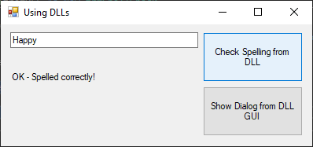
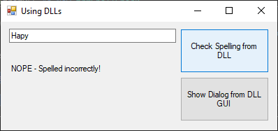
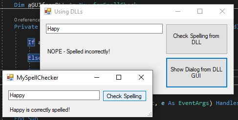
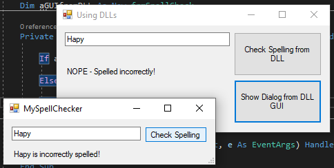

# SpellChecker-DLL
DLL for spellchecking. This is a simple GUI for accessing. This app serves more as a demo as this DLL can be applied to many other scenarios.

Using DLL in program (correct spelling)

Using DLL in program (incorrect spelling)

Using DLL GUI (correct spelling)

Using DLL GUI (incorrect spelling)

